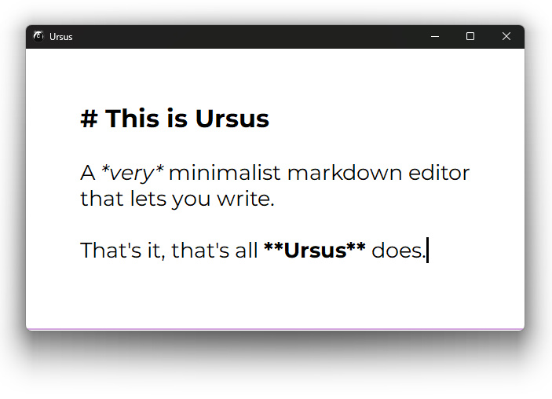

# Ursus

A *very* minimalist markdown editor

## Features

* Opens files (CTRL-L)
* Saves files (CTRL-S)
* Highlights some markdown syntax
  * Headings
  * Italics
  * Bold
* Copies the entire buffer to the clipboard as formatted HTML, good for pasting into other apps (CTRL-Shift-C)
